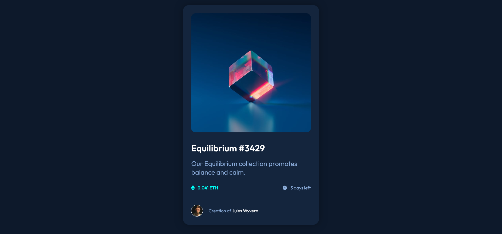

# Frontend Mentor - NFT preview card component solution

This is a solution to the [NFT preview card component challenge on Frontend Mentor](https://www.frontendmentor.io/challenges/nft-preview-card-component-SbdUL_w0U). Frontend Mentor challenges help you improve your coding skills by building realistic projects. 

## Table of contents

- [Overview](#overview)
  - [The challenge](#the-challenge)
  - [Screenshot](#screenshot)
  - [Links](#links)
- [My process](#my-process)
  - [Built with](#built-with)
  - [What I learned](#what-i-learned)
  - [Continued development](#continued-development)
  - [Useful resources](#useful-resources)
- [Author](#author)
- [Acknowledgments](#acknowledgments)

**Note: Delete this note and update the table of contents based on what sections you keep.**

## Overview

### The challenge

Users should be able to:

- View the optimal layout depending on their device's screen size
- See hover states for interactive elements

### Screenshot

### Links

- Solution URL: [Add solution URL here](https://your-solution-url.com)
- Live Site URL: [Add live site URL here](https://your-live-site-url.com)

## My process

### Built with

- Semantic HTML5 markup
- CSS custom properties
- Flexbox

### What I learned

Most important part of coding this project was figuring out how to anchor hover state to the image.
I've also gotten much more comfortable with using relative units.

### Continued development

Moving forward, I'd like to learn to use animations in my projects. I've also like to learn more about custom properties, since they seem to simplify keeping track of all the values like colours or spacings.

### Useful resources

- [CSS tricks](https://css-tricks.com/) - Helped me with understanding anchor positioning and I keep coming back to it to look up flexbox properties. Has helpful illustrations.

## Author

- github - [karolinam42](https://github.com/karolinam42)
- Frontend Mentor - [@karolinam42](https://www.frontendmentor.io/profile/karolinam42)
- LinkedIn - [Karolina M](https://www.linkedin.com/in/karolina-maryniak-96b3a3370/)
## Acknowledgments

Thank you, my cat, for forcing me to take a break by laying on my keyboard while putting random letters into my code.

